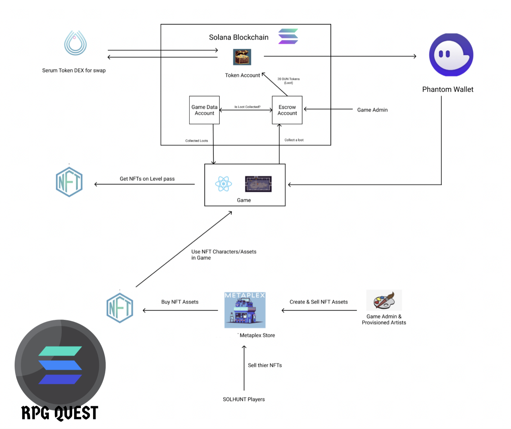
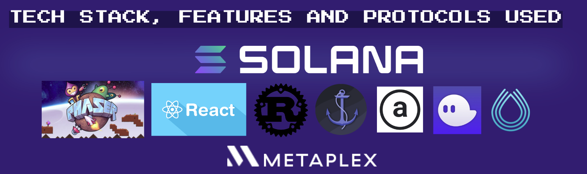

<h1 align="center">Solana RPG Quest Game</h1>

<a href="https://twitter.com/IntrantInferis"> Follow us on Twitter for the latest updates as this game is now being developed for mobile phones with even exciting gameplay mechanics and on-chain features, after the Solana Summer Camp hackathon </a>


Winner of gaming track at Solana Summer Camp '22. Currently we're building this game on mobile on Unity

A lightweight pixel multicharacter, Play To Earn dungeon game built on the Solana Blockchain, built with Phaser, powered by Metaplex. Our motivation is to enable users to own what you earn

DECK [Click to view](https://docs.google.com/presentation/d/1M5KTicsYGiwNwYJ3owjTZDLgN_Eky-6fTXqcaUfxq8o/edit?usp=sharing)

<p align="center">
  <a href="/">
    
  </a>
  <h6>Built at Encode Austin Hackathon Remote Participant && Solana Summer Camp Hackathon</h6>
  
  </p>

  <p>View the project demo on <a href="https://youtu.be/AQeXWPqfBpE">YouTube</a></p>
</p>

# ARCHITECTURE

<p>
 
</p>

# FEATURES

We built a lightweight pixel Play To Earn dungeon game built on the Solana Blockchain, built with Phaser. Our motivation is to enable users to own what you earn

**GAME DATA IS STORED ON-CHAIN WHICH MEANS THAT THE USER CAN'T COLLECT TREASURE (SPL TOKENS) PREVIOUSLY COLLECTED**

- Secure authentication with phantom wallet
- In Game Store
- NFT rewards as Level Passes that get stored in the Phantom Wallet
- $DUN(Dungeon) Token Rewards as Loot (SPL token)
- Auto save game progress on chain
- Metaplex Game storefront for buying game characters and using them as game assets as NFT. Every character is Rare and has unique abilities.
- Decentralised storage powered by ARWEAVE
- Using Metaplex NFT storefront powered by Arweave, one can claim a character by minting it on the marketplace and later equip it by selecting/unselcting it from the trophy cabinet in the user's dashboard.
- Swap $SOL for $DUN(game token), on serum DEX swap (ALPHA) in game to deposit token in escrow to play 

# Tech Stack
Anchor Frame along with Solana Program Library and Rust Smart Contracts were used to build the dApp and the game is built on React and Phaser.



## Quick Start

This app requires the following dependancies. Before continuing, download and install them:

- [Node.js](https://nodejs.org/en/download/) Node.js 10 or higher is required.
- [Anchor](https://project-serum.github.io/anchor/getting-started/installation.html#install-solana) Install version v0.13.2
- [Solana Tool Suite](https://docs.solana.com/cli/install-solana-cli-tools)

## Update Environment Variables

Add candy machine config to .env

```
cp .env.example .env
```

For this demo we have added our env variables, Feel free to update them.

## Running the program locally

```
cd program
npm run build // This will build the program
npm run deploy // This will deploy the program to the local solana network and copy idls generated to the client app.
```

## Running the app locally

### Install dependencies

```
cd client
npm install
```

### Create a mint authority

```
npm run initialize
```

### Start the development server

```
npm start
```

view game at [http://localhost:3000/](http://localhost:3000/)

### Gameplay

**Player has to defeat all the monsters, collect loot, get the keys to unlock the Solana token gate to pass the level. After finishing the level, the user get's a SPL NFT Token minted via the Metaplex Candy Machine Standard Contract and the metadata is stored on ArWeave.**

**Everytime, the user collects a chest, he is minted 20 DGN tokens as a reward**

**These tokens are not to be minted once collected. Progress of the game is stored on-chain via the Solana Escrow Program**


# Choose Multiple Characters using metaplex


```

```
