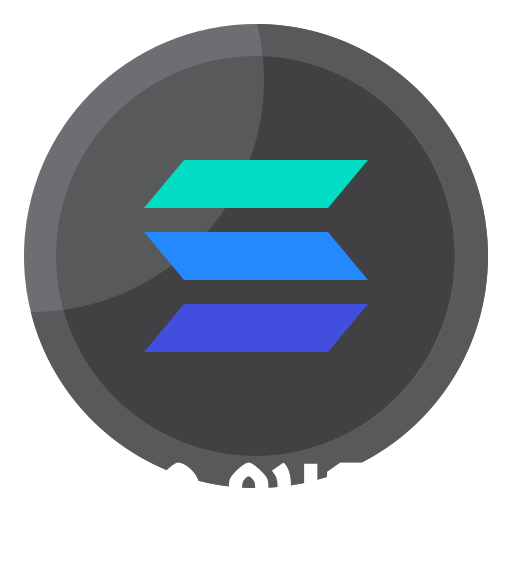

<h1 align="center">Solana RPG Quest Game</h1>

<p align="center">
  <a href="/">
    
  </a>
  <h6>Built at Enode Austin Hackathon Remote Participant</h6>
  </p>

  <p>View the project demo on <a href="">YouTube</a></p>
</p>

# ARCHITECTURE

<p>
 
</p>

# FEATURES

We built a lightweight pixel Play To Earn dungeon game built on the Solana Blockchain, built with Phaser. Our motivation is to enable users to own what you earn

**GAME DATA IS STORED ON-CHAIN WHICH MEANS THAT THE USER CAN'T COLLECT TREASURE (SPL TOKENS) PREVIOUSLY COLLECTED**

- Secure authentication with phantom wallet
- In Game Store
- NFT rewards as Level Passes that get stored in the Phantom Wallet
- $DUN(Dungeon) Token Rewards as Loot (SPL token)
- Auto save game progress on chain
- Metaplex Game storefront for buying game characters and using them as game assets as NFT. Every character is Rare and has unique abilities.
- Decentralised storage powered by ARWEAVE
- Swap $SOL for $DUN(game token), on serum DEX swap (ALPHA) in game to deposit token in escrow to play (COMING SOON)

# Tech Stack


## Quick Start

This app requires the following dependancies. Before continuing, download and install them:

- [Node.js](https://nodejs.org/en/download/) Node.js 10 or higher is required.
- [Anchor](https://project-serum.github.io/anchor/getting-started/installation.html#install-solana) Install version v0.13.2
- [Solana Tool Suite](https://docs.solana.com/cli/install-solana-cli-tools)

## Update Environment Variables

Add candy machine config to .env

```
cp .env.example .env
```

For this demo we have added our env variables, Feel free to update them.

## Running the program locally

```
cd program
npm run build // This will build the program
npm run deploy // This will deploy the program to the local solana network and copy idls generated to the client app.
```

## Running the app locally

### Install dependencies

```
cd client
npm install
```

### Create a mint authority

```
npm run initialize
```

### Start the development server

```
npm start
```

view game at [http://localhost:3000/](http://localhost:3000/)

### Gameplay


### Gameplay


```

```
